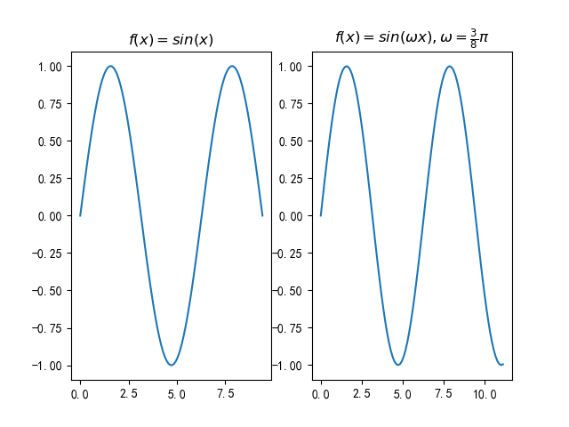

## LAB1基本信号显示
***

目的：通过编写基本程序，实现信号的显示。

***

代码1：
```
# -*- coding: UTF-8 -*-
#coding=utf-8

import matplotlib.pyplot as plt
import numpy as np 
# linspace 第一个参数序列起始值, 第二个参数序列结束值,第三个参数为样本数默认50
x = np.linspace(0, 3 * np.pi, 100)
y = np.sin(x)

plt.rcParams['font.sans-serif']=['SimHei'] #加上这一句就能在图表中显示中文
plt.rcParams['axes.unicode_minus']=False #用来正常显示负号
plt.subplot(1,2,1)
plt.title(r'$f(x)=sin(x)$') 
plt.plot(x, y)
#plt.show()

x1 = [t*0.375*np.pi for t in x]
y1 = np.sin(x1)
plt.subplot(1,2,2)
# plt.title(u"测试2") #注意：在前面加一个u
plt.title(r'$f(x)=sin(\omega x), \omega = \frac{3}{8} \pi$') 
plt.plot(x1, y1)
plt.show()
```

图形1：


***

代码2：
图形：

***

代码：
图形：

***

代码：
图形：

***

代码：
图形：

***

代码：
图形：

***

代码：
图形：